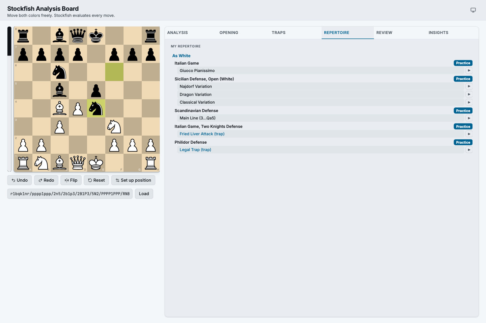
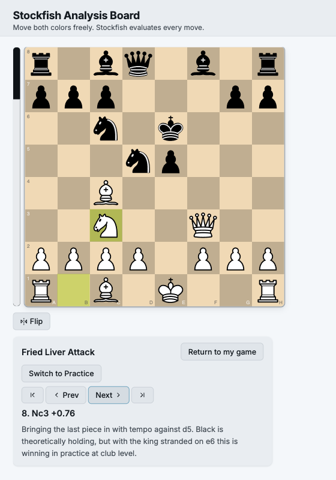

# Chess Coach — Stockfish Analysis Board

[](https://github.com/jcabiles/chess-coach/actions/workflows/ci.yml)

A local, single-user web app: an interactive chess board where you move **both
colors** freely, jump to any position by FEN, and get **live Stockfish feedback**
(eval, best move + line, move-quality label) after every move.

It has grown into a small **training suite**: an **opening trainer**, an
**opening-traps trainer**, a **repertoire trainer**, a **game-review coach**
that imports your past games and flags your recurring mistakes — with a warning a
move *before* each blunder — an **insights dashboard** that turns those reviews
into cross-game analytics, and a **blunder trainer** that re-serves your own
mistakes as spaced-repetition puzzles.

All open-source, free, and local-first. No accounts. Runtime API calls stay on
your machine; the page may fetch pinned frontend assets from a CDN on first load.

## Built AI-first

Solo-built with an AI-native workflow (Claude Code + Codex) — and the process is
checked in, not just claimed:

- **Spec → contract map → adversarial review → tickets → verified code** — every
  feature's full paper trail lives in [`docs/ai-dlc/`](docs/ai-dlc/): 14 specs, 11
  hardened by a fresh-context "refuter" agent that attacks the spec before any
  implementation.
- **Versioned guardrails** — [`CLAUDE.md`](CLAUDE.md) encodes the constraints the
  assistant must obey (engine-lock serialization, purity seams, commit policy);
  [`.claude/settings.json`](.claude/settings.json) sandboxes it (denied secret
  reads, no force-push, no direct pushes to `main`).
- **AI-legible is testable** — pure logic modules (e.g. `analysis`, `motifs`,
  `pgn`) plus engine-free read-models (`profile`, `insights`) never touch
  Stockfish, and the engine wrapper sits behind a fake-engine seam, so the full
  600+-test suite runs with no engine binary. Module map and invariants:
  [`ARCHITECTURE.md`](ARCHITECTURE.md).
- **Deterministic at runtime** — the game-review coach is pure Stockfish +
  python-chess with template narration: no LLM calls, no tokens, fully local.
- **Analytics, not just code** — a [KPI tree & metric dictionary](docs/analytics/kpi-tree.md)
  decomposes "get better at chess" into the driver metrics the app computes
  (each with definition, source, and an honest caveat), and
  [State of my chess](docs/analytics/state-of-my-chess.md) is a reproducible
  analytical report over the real game database — findings → ranked
  recommendations, every number traceable to a query in the appendix.
- **The LLM feature ships with evals** — [`docs/analytics/EVALS.md`](docs/analytics/EVALS.md):
  a checked-in golden set, deterministic grounding checks that fail CI when
  commentary invents a move, an LLM-as-judge runner, and an explicit
  judge-trust policy ([`evals/`](evals/)).


<table>
<tr>
<td width="60%" valign="top">

**Repertoire trainer** — your prepared lines per color (Italian, Open Sicilian,
Scandinavian…), each browsable move-by-move or drillable in practice with
live deviation-checking.



</td>
<td width="40%" valign="top">

**Opening-traps trainer** — a curated catalog with watch + practice modes and
per-move coaching notes.



</td>
</tr>
</table>

## Stack
- **Backend:** FastAPI + Uvicorn, [python-chess](https://python-chess.readthedocs.io/) (engine driver + rules)
- **Engine:** [Stockfish](https://stockfishchess.org/) (installed separately)
- **Frontend:** [chessground](https://github.com/lichess-org/chessground) (board) + [chessops](https://github.com/niklasf/chessops) (client-side legality)

## Setup

1. **Install Stockfish** (the engine binary):
   ```sh
   brew install stockfish      # macOS
   # Linux: apt install stockfish  |  or download from stockfishchess.org
   ```
   Verify: `stockfish` should launch a UCI prompt (Ctrl-D to exit).

   **(Optional) Maia — human-like bot moves.** With [lc0](https://lczero.org/)
   and the [Maia](https://www.maiachess.com/) nets installed, the Ming Ling bot
   plays moves from a neural net trained on real human games (it falls back to
   Stockfish automatically when absent — nothing else changes):
   ```sh
   brew install lc0
   mkdir -p ~/maia_weights && cd ~/maia_weights
   curl -fsSLO "https://raw.githubusercontent.com/CSSLab/maia-chess/master/maia_weights/maia-1400.pb.gz"
   ```

2. **Python env** (3.12+):
   ```sh
   python3 -m venv .venv
   source .venv/bin/activate
   pip install -r requirements.txt
   ```

3. **(Optional, recommended) [direnv](https://direnv.net/)** — auto-activates
   the venv and exposes the `chess-coach` command whenever you `cd` into
   this repo:
   ```sh
   brew install direnv                            # macOS; see direnv.net for other OSes
   echo 'eval "$(direnv hook zsh)"' >> ~/.zshrc    # or ~/.bashrc for bash
   direnv allow .                                  # one-time per clone: trusts this repo's .envrc
   ```

4. **Run:**
   ```sh
   chess-coach            # with direnv: start the server in the background
   chess-coach stop       #   stop / restart / status also work
   ```
   or, without direnv:
   ```sh
   scripts/serve.sh start   # same background start/stop/restart/status
   # — or, for active development with auto-reload on file changes —
   uvicorn app.main:app --reload --port 8001
   ```
   Open <http://localhost:8001>.

   > Port **8001** is the default here because **8000** (uvicorn's own default)
   > is commonly taken by other local apps. Override with `PORT=8123
   > chess-coach` (or `--port 8123` for the raw `uvicorn` command). Run two
   > apps at once by giving each its own port; no need to stop the other.

5. **(Optional) AI game commentary** — everything else in the app is fully
   offline; this one feature calls the Anthropic API (a few cents per game,
   only when you click **Generate commentary** in a reviewed game):
   ```sh
   pip install -r requirements.txt        # picks up the anthropic SDK
   export ANTHROPIC_API_KEY=sk-ant-...    # https://console.anthropic.com/
   # restart the server, open a reviewed game → Generate commentary
   ```
   Without the key the button stays disabled and nothing ever leaves your
   machine.

## Configuration (optional)

All via environment variables; sensible defaults mean none are required to start.

| Variable | Default | What it does |
|----------|---------|--------------|
| `STOCKFISH_PATH` | `stockfish` on `PATH` | Path to the engine binary, if it isn't on your `PATH`. |
| `CHESS_USERNAME` | _(unset)_ | Comma-separated names/aliases you play under (lichess / chess.com). Imported games are tagged with **your** color so the review coach analyzes *your* mistakes only. If unset, set the color per-import in the Review tab; un-tagged games are skipped in the profile. |
| `GAMES_DB` | `data/games.db` | SQLite file for saved games + cached analysis (gitignored). |
| `REVIEW_BG_DEPTH` | `10` | Stockfish depth for background game-review analysis. Interactive moves use a deeper search; the background job yields to interactive requests so play stays responsive. |
| `ENGINE_SOFT_TIME` | `3.0` | Soft per-search time cap (seconds) for interactive analysis: Stockfish stops at the target depth **or** this time, whichever comes first, so a sharp position can't stall the UI. |
| `ENGINE_HARD_TIMEOUT` | `8.0` | Hard watchdog (seconds): any single engine call exceeding this auto-kills and relaunches the Stockfish process so it can never wedge. Must be greater than `ENGINE_SOFT_TIME`. |
| `ANTHROPIC_API_KEY` | _(unset)_ | Enables the **AI game commentary** button in Review (the app's only outbound call; everything else is offline). API key only — OAuth is not supported. |
| `NARRATIVE_MODEL` | `claude-sonnet-5` | Anthropic model used for game commentary. |
| `NARRATIVE_TIMEOUT_S` | `60` | Hard timeout (seconds) for one commentary generation call. |

Saved games and their analysis live in `data/games.db` (and any PGNs you drop in
`data/games/`) — both gitignored, never committed.

## Opening data

The opening trainer uses the bundled lichess-org/chess-openings TSVs under
`data/openings/`. These files are **CC0 / public domain**.

## Usage
- Drag pieces to play **either color**. Illegal moves snap back.
- Paste a **FEN** and click *Load* to jump to a position.
- After each move: eval, Stockfish's best move + line, and a quality label
  (best / good / inaccuracy / mistake / blunder).
- **Evaluate** toggle (Both / White / Black): set it to your color and Stockfish
  only analyzes **your** moves — the opponent's are shown as "not evaluated" and
  skip the engine entirely, roughly halving the work (faster, less load). *Both*
  (the default) analyzes every move as before. Your choice is remembered.
- If the engine ever feels stuck, the **Restart engine** button in the Analysis
  panel relaunches Stockfish without disturbing your game (the position and move
  list are preserved). Searches are time-bounded and a watchdog auto-restarts a
  hung engine, so the app shouldn't wedge in the first place.
- **Undo/redo** (or click any move in the **move list**) to step through your
  line; **Flip** to rotate the board.
- **Set up position** to arrange any position freely, then *Begin Game*.
- **Opening trainer:** the panel names the opening of your current line and lists
  named openings reachable from here. Click one to **study** it — step through the
  moves on the board with the eval and a note on the idea behind each move.
- **Opening Traps:** browse a curated set of beginner opening traps (filter by name
  or color). **Watch mode** steps through a trap line with eval + coaching notes;
  the branch point shows the expected mistake and what Black (or White) should do
  instead. **Practice mode** lets you play the trapping side while the opponent
  plays the standard blunder — find the punishing moves (wrong moves revert; "Reveal"
  hints, "Show refutation" gives the defense). A **Trap available** chip appears
  during play when you reach a known trap's starting position. Data lives in
  `data/traps.json` (engine-verified, original commentary; 19 traps shipped).
- **Repertoire trainer:** browse your prepared lines per color (a catalog grouped
  by opening) and **practice** them — the opponent plays prepared replies and you
  must find your single prepared move; deviations are flagged. Lines live in
  `data/repertoire.json` (SAN lines or `trapId` references, replayed and validated
  with python-chess).
- **Game Review & Coaching:** import your past games (paste/upload a **PGN** in the
  Review tab, or drop `.pgn` files in `data/games/`), saved to a local database and
  **preloaded** on restart. Replay any game step-by-step, then get two things:
  a **tendency profile** of your most common mistakes/blunders across all games
  (by motif, game phase, opening, color, plus a "hope-chess" rate and trend), and
  **foresight warnings** during replay that fire a move *before* each blunder —
  explaining the developing threat in Threat / Hanging / Plan terms (e.g. "the
  opponent is threatening mate on f7 — defend now"). The analysis is **deterministic**
  (Stockfish + python-chess: win-probability drop, null-move threat detection,
  static-exchange + motif tagging); no LLM/tokens. Set `CHESS_USERNAME` (see
  Configuration above) so it knows which color is yours, or pick the color per-import.
  Opening a reviewed game also shows an **estimated Accuracy % and Elo for both
  sides** (you and your opponent) in the review bar — Chess.com-style, derived from
  the per-move evals already computed (no extra engine work). The rating is a rough
  single-game estimate, not an official number. With an `ANTHROPIC_API_KEY` set
  (see Setup step 5) an on-demand **AI game commentary** button appears: Claude
  writes a chaptered story of the game plus short notes pinned to the key moves
  (blunders on both sides, momentum swings, critical positions), grounded
  strictly in the Stockfish facts above — the engine owns every concrete claim;
  the LLM only narrates. Generated once per game, cached in the same database,
  and regenerable on demand.
- **Insights:** a read-only analytics tab over your reviewed games — opening
  performance vs your repertoire, mistake patterns by motif/phase (with
  foreseeable-blunder and time-trouble cards), and endgame conversion — each card
  deep-linking into the exact game and move it came from.
- **Blunder Trainer:** the **Train** section in the Review tab re-serves your own
  recorded mistakes as puzzles. Scheduling is Leitner spaced repetition over
  **motif buckets** (fork, pin, back rank…), rotating through *different* positions
  each review so you learn the pattern, not the board. Your answer is checked live
  by Stockfish (close-enough alternatives count); a miss gets one retry, then the
  answer plus the same threat-narration the review coach uses.

## Develop / test
```sh
pytest                      # full suite — runs without a Stockfish binary
                            # (engine code is exercised via a fake-engine seam)
pytest tests/test_analysis.py   # pure logic only
```

## Project layout
```
app/        FastAPI app + single-engine wrapper; pure logic (analysis, motifs,
            trainer); SQLite storage, PGN import, the game-review pipeline,
            coaching/profile/insights read-models, and per-trainer logic
            (openings, traps, book, repertoire, blunder trainer)
static/     frontend — one SPA, a small hub (app.js) plus per-feature modules
            (setup, traps, repertoire, review, insights, trainer…) wired through
            an injected api; chessground/chessops from pinned CDNs
data/       bundled opening TSVs + traps/book/repertoire JSON; your saved games
            (data/games.db, data/games/) are gitignored
tests/      unit + API tests; the whole suite runs with no Stockfish binary present
docs/       design specs, build plans, and research notes per feature
```

## Frontend asset versions
Pinned in `static/index.html`.
